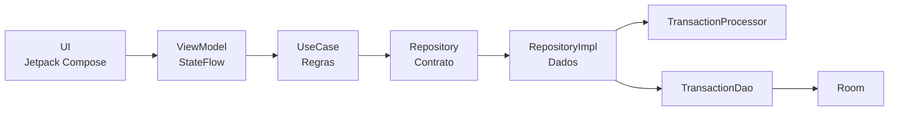
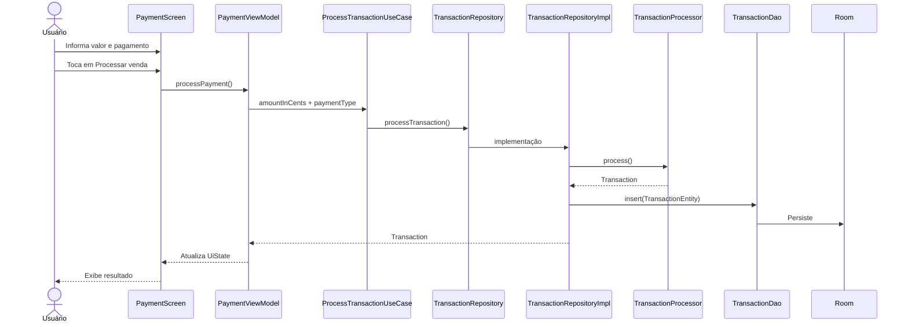
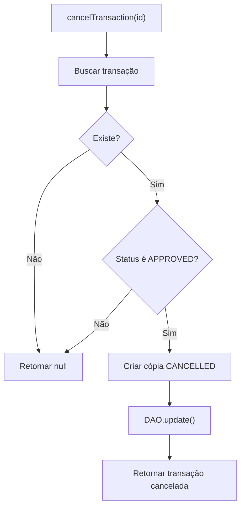
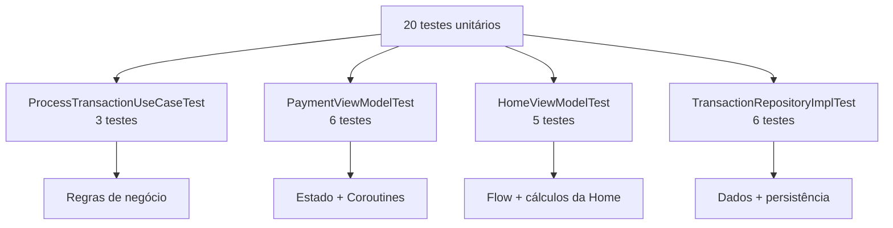
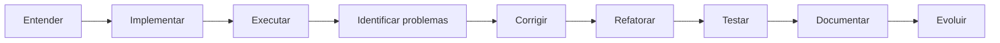

<div align="center">

# CieloPayLab

### Simulação de pagamentos, arquitetura Android e testes automatizados

<br>


<br>

**MVVM • Clean Architecture • Repository Pattern • Room • Coroutines • Flow • 20 testes unitários**
</div>
<div>


Projeto Android desenvolvido como laboratório prático para estudo de arquitetura,
gerenciamento de estado, persistência, regras de negócio e qualidade de software.

</div>

---

## Sumário

- [Sobre o projeto](#sobre-o-projeto)
- [O que já foi implementado](#o-que-já-foi-implementado)
- [Como o aplicativo funciona](#como-o-aplicativo-funciona)
- [Arquitetura](#arquitetura)
- [Fluxo completo de uma venda](#fluxo-completo-de-uma-venda)
- [Interface e gerenciamento de estado](#interface-e-gerenciamento-de-estado)
- [Camada de domínio](#camada-de-domínio)
- [Repository e camada de dados](#repository-e-camada-de-dados)
- [Persistência com Room](#persistência-com-room)
- [Histórico, filtros e cancelamento](#histórico-filtros-e-cancelamento)
- [Injeção de dependências com Hilt](#injeção-de-dependências-com-hilt)
- [Coroutines e programação assíncrona](#coroutines-e-programação-assíncrona)
- [Estratégia de testes](#estratégia-de-testes)
- [Estrutura do projeto](#estrutura-do-projeto)
- [Tecnologias utilizadas](#tecnologias-utilizadas)
- [Decisões técnicas](#decisões-técnicas)
- [Segurança e integração REST](#segurança-e-integração-rest)
- [Próximos passos](#próximos-passos)
- [Autora](#autora)

---

# Sobre o projeto

O **CieloPayLab** é um aplicativo Android nativo desenvolvido em **Kotlin** para simular operações de pagamento e, principalmente, estudar como diferentes partes de uma aplicação Android moderna trabalham juntas.

O usuário pode:

- registrar uma nova venda;
- informar o valor da transação;
- escolher entre Crédito, Débito e Pix;
- acompanhar o processamento;
- visualizar o resultado da operação;
- consultar as últimas movimentações;
- acessar o histórico completo;
- filtrar transações;
- ordenar transações;
- consultar detalhes;
- cancelar uma venda aprovada;
- excluir uma movimentação.

O objetivo do projeto, porém, vai além das telas.

O CieloPayLab foi estruturado para estudar e aplicar conceitos encontrados em projetos Android profissionais:

```text
Interface
   +
Gerenciamento de estado
   +
Arquitetura
   +
Regras de negócio
   +
Persistência
   +
Código assíncrono
   +
Testes automatizados
   +
Manutenção
   +
Documentação
```

A intenção é entender não apenas **como fazer uma funcionalidade funcionar**, mas também:

> **Onde essa funcionalidade deve ficar?  
> Qual classe deve ser responsável por ela?  
> Como evitar acoplamento?  
> Como testar esse comportamento?  
> Como manter o código preparado para evoluir?**

> **Importante:** o CieloPayLab é um projeto educacional.  
> Ele não processa pagamentos financeiros reais.

---

# O que já foi implementado

| Funcionalidade | Status |
|---|:---:|
| Dashboard da Home | ✅ |
| Resumo das vendas do dia | ✅ |
| Nova venda | ✅ |
| Pagamento com Crédito | ✅ |
| Pagamento com Débito | ✅ |
| Pagamento com Pix | ✅ |
| Formatação monetária em BRL | ✅ |
| Validação do valor | ✅ |
| Estado de loading | ✅ |
| Resultado da transação | ✅ |
| Persistência local | ✅ |
| Últimas movimentações | ✅ |
| Histórico completo | ✅ |
| Filtro por status | ✅ |
| Filtro por período | ✅ |
| Ordenação por data | ✅ |
| Ordenação por valor | ✅ |
| Detalhes da transação | ✅ |
| Cancelamento | ✅ |
| Exclusão | ✅ |
| Tratamento de erros | ✅ |
| Testes de UseCase | ✅ |
| Testes de ViewModel | ✅ |
| Testes de Repository | ✅ |
| **20 testes unitários** | ✅ |
| Testes de UI | 🔄 Próxima etapa |

---

# Como o aplicativo funciona

Atualmente o aplicativo possui quatro fluxos principais:

```text
                         CieloPayLab
                              │
                              ▼
                            HOME
                              │
               ┌──────────────┼───────────────┐
               │              │               │
               ▼              ▼               ▼
          NOVA VENDA     MOVIMENTAÇÕES      HISTÓRICO
                                               │
                                               ▼
                                           DETALHES
                                               │
                                    ┌──────────┴──────────┐
                                    │                     │
                                    ▼                     ▼
                                 CANCELAR              EXCLUIR
```

A **Home** oferece uma visão rápida das vendas.

A **Nova venda** permite iniciar uma transação.

As **Últimas movimentações** mostram somente as três transações mais recentes.

O **Histórico** permite uma consulta mais completa, com filtros e ordenação.

A tela de **Detalhes** permite visualizar informações específicas e executar ações sobre uma transação.

---

# Arquitetura

O projeto utiliza **MVVM** com separação de responsabilidades inspirada em **Clean Architecture**.

A arquitetura pode ser visualizada de forma simplificada assim:



As responsabilidades são separadas em três grandes áreas:

```text
┌─────────────────────────────────────────────┐
│                    UI                       │
│                                             │
│ Screens • Components • ViewModels • UiState │
└─────────────────────┬───────────────────────┘
                      │
                      ▼
┌─────────────────────────────────────────────┐
│                  DOMAIN                     │
│                                             │
│ Models • UseCases • Repository interfaces   │
└─────────────────────┬───────────────────────┘
                      │
                      ▼
┌─────────────────────────────────────────────┐
│                   DATA                      │
│                                             │
│ RepositoryImpl • Processor • Room • DAO     │
│ Entities • Mappers                          │
└─────────────────────────────────────────────┘
```

| Camada | Responsabilidade | Exemplos |
|---|---|---|
| **UI** | Mostrar informações e receber ações | `PaymentScreen`, componentes |
| **ViewModel** | Controlar e transformar o estado da UI | `PaymentViewModel`, `HomeViewModel` |
| **Domain** | Representar regras e modelos do negócio | `Transaction`, `ProcessTransactionUseCase` |
| **Repository** | Definir operações relacionadas aos dados | `TransactionRepository` |
| **Data** | Implementar as operações do Repository | `TransactionRepositoryImpl` |
| **Persistence** | Armazenar e consultar informações | `TransactionDao`, Room |

---

<details>
<summary><strong>Para quem está começando: por que separar o projeto em camadas?</strong></summary>

<br>

Imagine uma aplicação onde a própria tela faz tudo:

```text
PaymentScreen
   │
   ├── recebe o valor
   ├── valida
   ├── processa
   ├── acessa o banco
   ├── salva
   ├── trata erro
   ├── calcula estado
   └── mostra resultado
```

No início isso pode parecer mais simples.

Mas conforme o projeto cresce, a tela passa a ter responsabilidades demais.

No CieloPayLab buscamos algo diferente:

```text
PaymentScreen
      │
      ▼
PaymentViewModel
      │
      ▼
ProcessTransactionUseCase
      │
      ▼
TransactionRepository
      │
      ▼
TransactionRepositoryImpl
      │
      ├──── TransactionProcessor
      │
      └──── TransactionDao
                  │
                  ▼
                 Room
```

Cada classe possui uma responsabilidade mais específica.

Isso facilita:

- leitura;
- manutenção;
- testes;
- substituição de implementações;
- identificação de erros;
- evolução do projeto.

</details>

---

# Fluxo completo de uma venda

Uma das melhores formas de entender o projeto é acompanhar uma venda do início ao fim.



Vamos detalhar esse fluxo.

### 1. O usuário informa o valor

O valor digitado é tratado pelo `PaymentViewModel`.

Somente os dígitos são mantidos no estado.

### 2. O valor é convertido

A aplicação utiliza `CurrencyUtils` para transformar os dígitos em centavos.

### 3. O valor é validado

Antes do processamento, o valor precisa ser maior que zero.

### 4. A interface entra em loading

O estado é atualizado:

```text
isLoading = true
```

### 5. O UseCase é executado

O `ProcessTransactionUseCase` aplica a regra de negócio.

### 6. O Repository recebe a operação

O Repository coordena o processamento e a persistência.

### 7. A transação é processada

`TransactionProcessor` devolve uma `Transaction`.

### 8. A transação é persistida

A `Transaction` é convertida para `TransactionEntity` e enviada ao DAO.

### 9. O resultado volta para o ViewModel

O estado recebe a transação processada.

### 10. Compose atualiza a tela

Como a interface observa o estado, ela apresenta o resultado ao usuário.

---

# Interface e gerenciamento de estado

A interface do CieloPayLab foi desenvolvida utilizando **Jetpack Compose** e **Material 3**.

O Compose utiliza uma abordagem declarativa.

Isso significa que a interface é descrita de acordo com o estado atual da aplicação.

Em vez de pensar:

```text
"encontre este botão e altere manualmente seu texto"
```

pensamos:

```text
"se isLoading for true, mostre o estado de carregamento"
```

---

## PaymentUiState

O `PaymentViewModel` mantém o estado da tela utilizando `PaymentUiState`.

O estado contém informações necessárias para representar a tela, como:

```text
amount
paymentType
isLoading
transaction
errorMessage
```

Podemos imaginar o `PaymentUiState` como uma fotografia da tela em determinado momento.

### Estado inicial

```text
amount = ""
isLoading = false
transaction = null
errorMessage = null
```

### Durante o processamento

```text
isLoading = true
transaction = null
errorMessage = null
```

### Após sucesso

```text
isLoading = false
transaction = Transaction(...)
errorMessage = null
```

### Após erro

```text
isLoading = false
transaction = null
errorMessage = "..."
```

---

## MutableStateFlow e StateFlow

No ViewModel temos:

```kotlin
private val _uiState = MutableStateFlow(PaymentUiState())

val uiState: StateFlow<PaymentUiState> =
    _uiState.asStateFlow()
```

Existe uma diferença importante entre os dois.

### MutableStateFlow

Pode ser alterado pelo ViewModel.

```text
_uiState
```

### StateFlow

É disponibilizado para observação.

```text
uiState
```

Assim:

```text
              pode alterar
                  │
                  ▼
             ViewModel
                  │
                  ▼
          MutableStateFlow
                  │
                  ▼
              StateFlow
                  │
                  ▼
                 UI
              observa
```

A UI observa o estado, mas não precisa controlar diretamente sua mutação.

---

## LoadingButton

O projeto possui um componente reutilizável chamado:

```text
LoadingButton
```

Ele representa dois estados principais.

### Estado normal

```text
┌──────────────────────────────┐
│       Processar venda        │
└──────────────────────────────┘
```

### Estado de processamento

```text
┌──────────────────────────────┐
│        ◌  Aguarde...         │
└──────────────────────────────┘
```

Durante o processamento:

```text
isLoading = true
```

e o botão também é desabilitado.

Isso ajuda a impedir múltiplos disparos da mesma operação.

---

## Componentização

A interface foi dividida em componentes menores e reutilizáveis.

Entre eles estão componentes para:

- resumo das vendas;
- status das transações;
- ações da Home;
- campo monetário;
- seleção de pagamento;
- botão com loading;
- resultado da transação;
- item do histórico;
- filtros;
- período;
- ordenação;
- resumo do histórico;
- detalhes da transação.

Exemplos:

```text
LoadingButton
PaymentTypeSelector
TransactionResult
TransactionHistoryItem
TransactionFilterBar
TransactionPeriodMenu
TransactionSortMenu
TransactionHistorySummary
```

Essa divisão evita telas muito grandes e facilita manutenção.

---

## Preview

Os componentes Compose também utilizam:

```kotlin
@Preview
```

O Preview permite visualizar um Composable diretamente no Android Studio.

Exemplo:

```kotlin
@Preview(showBackground = true)
@Composable
fun LoadingButtonPreview() {
    LoadingButton(
        text = "Processar venda",
        isLoading = true,
        enabled = true,
        onClick = {}
    )
}
```

Isso permite verificar rapidamente diferentes estados visuais sem precisar percorrer todo o aplicativo.

---

# Camada de domínio

A camada `domain` contém elementos que representam o negócio da aplicação.

Entre eles estão:

```text
Transaction
PaymentType
TransactionStatus
TransactionRepository
ProcessTransactionUseCase
```

---

## Transaction

`Transaction` representa uma transação dentro do domínio.

Ela possui informações como:

```text
id
amountInCents
paymentType
status
timestamp
responseTimeMillis
```

---

## PaymentType

Representa as formas de pagamento disponíveis.

```text
CREDIT
DEBIT
PIX
```

Na interface esses valores são apresentados como:

```text
Crédito
Débito
Pix
```

---

## TransactionStatus

Os estados atualmente existentes são:

| Status | Significado |
|---|---|
| `APPROVED` | Transação aprovada |
| `DECLINED` | Transação recusada |
| `CANCELLED` | Transação cancelada |
| `ERROR` | Erro relacionado ao processamento |

---

## ProcessTransactionUseCase

O `ProcessTransactionUseCase` representa a operação de processar uma transação.

Sua estrutura é:

```kotlin
class ProcessTransactionUseCase @Inject constructor(
    private val repository: TransactionRepository
) {

    suspend operator fun invoke(
        amountInCents: Long,
        paymentType: PaymentType
    ): Transaction {

        require(amountInCents > 0) {
            "O valor da transação deve ser maior que zero."
        }

        return repository.processTransaction(
            amountInCents = amountInCents,
            paymentType = paymentType
        )
    }
}
```

A regra importante é:

```kotlin
require(amountInCents > 0)
```

Portanto:

```text
10000L  -> permitido
500L    -> permitido
1L      -> permitido

0L      -> inválido
-100L   -> inválido
```

---

<details>
<summary><strong>Para quem está começando: o que é um UseCase?</strong></summary>

<br>

Um UseCase representa uma ação ou regra do sistema.

Neste projeto:

```text
ProcessTransactionUseCase
```

representa:

```text
Processar uma transação
```

A vantagem é não deixar essa regra dentro da tela.

Se a regra estivesse em `PaymentScreen`, ela ficaria ligada à interface.

Com o UseCase:

```text
UI
 │
 ▼
ViewModel
 │
 ▼
UseCase
```

a regra fica separada.

Isso também facilita os testes.

Podemos testar:

```text
"valor zero deve ser rejeitado"
```

sem precisar abrir nenhuma tela.

</details>

---

# Repository e camada de dados

O projeto utiliza o **Repository Pattern**.

A camada de domínio possui o contrato:

```text
TransactionRepository
```

A camada de dados possui a implementação:

```text
TransactionRepositoryImpl
```

Visualmente:

```text
DOMAIN
   │
   │ conhece
   ▼
TransactionRepository
   ▲
   │ implementado por
   │
TransactionRepositoryImpl
   │
   ▼
DATA
```

O Repository possui responsabilidades relacionadas às transações, como:

```text
processTransaction()
observeTransactions()
getTransactionById()
cancelTransaction()
deleteTransaction()
```

---

## Processamento

Quando `processTransaction()` é chamado:

```kotlin
val transaction = transactionProcessor.process(
    amountInCents = amountInCents,
    paymentType = paymentType
)
```

O `TransactionProcessor` devolve uma transação.

Depois:

```kotlin
transactionDao.insert(
    transaction.toEntity()
)
```

A transação é persistida.

Por fim:

```kotlin
return transaction
```

o resultado volta para quem solicitou o processamento.

Fluxo:

```text
Repository
    │
    ▼
TransactionProcessor
    │
    ▼
Transaction
    │
    ▼
toEntity()
    │
    ▼
TransactionEntity
    │
    ▼
TransactionDao.insert()
    │
    ▼
Room
```

---

## TransactionProcessor

`TransactionProcessor` é definido como uma interface:

```kotlin
interface TransactionProcessor {

    suspend fun process(
        amountInCents: Long,
        paymentType: PaymentType
    ): Transaction
}
```

O Repository depende dessa abstração para realizar o processamento.

Uma vantagem dessa separação aparece claramente nos testes.

Podemos substituir o processor real por um mock:

```text
Aplicação:

Repository
    │
    ▼
TransactionProcessor real
```

```text
Teste:

Repository
    │
    ▼
TransactionProcessor mock
```

Assim conseguimos controlar exatamente qual transação será devolvida.

---

# Persistência com Room

O CieloPayLab utiliza **Room** para persistência local.

Room fornece uma camada de abstração sobre o SQLite.

A estrutura utilizada pode ser entendida assim:

```text
Domain
Transaction
    │
    │ toEntity()
    ▼
Data
TransactionEntity
    │
    ▼
TransactionDao
    │
    ▼
Room
    │
    ▼
SQLite
```

---

## TransactionEntity

O domínio trabalha com:

```text
Transaction
```

Enquanto a persistência trabalha com:

```text
TransactionEntity
```

Essa separação impede que o domínio fique diretamente acoplado ao formato utilizado pelo banco.

---

## Mappers

Para converter entre esses dois mundos são utilizados mapeamentos:

```text
Transaction
    │
    │ toEntity()
    ▼
TransactionEntity
```

e:

```text
TransactionEntity
    │
    │ toDomain()
    ▼
Transaction
```

---

<details>
<summary><strong>Para quem está começando: por que não usar Transaction diretamente no Room?</strong></summary>

<br>

Poderíamos acoplar o modelo de domínio diretamente ao banco.

Mas isso faria o domínio conhecer detalhes da persistência.

Ao manter:

```text
Transaction
```

e:

```text
TransactionEntity
```

separados, podemos modificar detalhes do banco sem necessariamente modificar o modelo utilizado pelas regras de negócio.

O mapper funciona como uma ponte:

```text
DOMAIN                         DATA

Transaction  <------------>  TransactionEntity
             mapper
```

</details>

---

## TransactionDao

DAO significa:

```text
Data Access Object
```

É o componente responsável pelas operações de acesso ao banco.

O `TransactionDao` possui:

```kotlin
insert()
update()
observeTransactions()
getTransactionById()
deleteById()
```

### Inserção

```kotlin
@Insert(onConflict = OnConflictStrategy.REPLACE)
suspend fun insert(
    transaction: TransactionEntity
)
```

### Atualização

```kotlin
@Update
suspend fun update(
    transaction: TransactionEntity
)
```

### Observação

```kotlin
fun observeTransactions():
    Flow<List<TransactionEntity>>
```

### Busca

```kotlin
suspend fun getTransactionById(
    id: String
): TransactionEntity?
```

### Exclusão

```sql
DELETE FROM transactions
WHERE id = :id
```

---

## Flow vindo do banco

Uma característica importante é:

```kotlin
Flow<List<TransactionEntity>>
```

Isso significa que não estamos necessariamente buscando os dados uma única vez.

O fluxo pode emitir novas informações quando os dados mudam.

```text
Room
 │
 │ dados mudaram
 ▼
Flow
 │
 │ nova lista
 ▼
Repository
 │
 ▼
ViewModel
 │
 ▼
StateFlow
 │
 ▼
Compose
```

---

# Valores monetários

Os valores são representados internamente em **centavos utilizando `Long`**.

Por exemplo:

```text
R$ 150,00
```

é armazenado como:

```text
15000L
```

E:

```text
R$ 89,90
```

como:

```text
8990L
```

O projeto utiliza:

```text
CurrencyUtils
```

para auxiliar na conversão e formatação.

### Por que não `Double`?

Números de ponto flutuante podem introduzir problemas de precisão.

Para este laboratório, manter o valor em centavos utilizando um inteiro torna a representação mais previsível.

```text
Tela                   Domínio

R$ 150,00  ----------> 15000L
```

---

# Home, Flow e StateFlow

O `HomeViewModel` possui um fluxo um pouco diferente do `PaymentViewModel`.

Ele observa diretamente:

```kotlin
repository.observeTransactions()
```

O Repository devolve:

```text
Flow<List<Transaction>>
```

Depois o ViewModel transforma essa lista:

```kotlin
.map { transactions ->
    ...
}
```

e cria:

```text
HomeUiState
```

Fluxo:

```text
Room
 │
 ▼
TransactionDao
 │
 ▼
Repository
 │
 ▼
Flow<List<Transaction>>
 │
 ▼
map
 │
 ▼
HomeUiState
 │
 ▼
stateIn
 │
 ▼
StateFlow<HomeUiState>
 │
 ▼
Home
```

---

## Resumo diário

O ViewModel calcula o início do dia:

```text
00:00:00
```

e seleciona as transações do dia atual.

Depois separa:

```text
APPROVED
```

e:

```text
CANCELLED
```

As aprovadas são utilizadas para calcular:

- total vendido;
- quantidade de vendas aprovadas.

As canceladas são utilizadas para:

- quantidade de vendas canceladas.

---

## Últimas movimentações

Para as últimas movimentações:

```kotlin
transactions
    .sortedByDescending {
        it.timestamp
    }
    .take(3)
```

Isso significa:

```text
Todas as transações
        │
        ▼
Ordenar pela mais recente
        │
        ▼
Selecionar 3
        │
        ▼
Últimas movimentações
```

Por isso a Home não precisa apresentar scroll para mostrar todo o histórico.

Para isso existe a tela de Histórico.

---

## stateIn

O `HomeViewModel` utiliza:

```kotlin
.stateIn(
    scope = viewModelScope,
    started = SharingStarted.WhileSubscribed(5_000),
    initialValue = HomeUiState(
        isLoading = true
    )
)
```

O `stateIn` transforma o Flow em um StateFlow.

Assim:

```text
Flow
 │
 ▼
stateIn
 │
 ▼
StateFlow
```

O `initialValue` representa o estado disponível antes da primeira emissão dos dados.

---

<details>
<summary><strong>Para quem está começando: Flow e StateFlow são a mesma coisa?</strong></summary>

<br>

Não exatamente.

Uma forma simplificada de pensar é:

### Flow

Representa valores que podem ser emitidos ao longo do tempo.

```text
valor 1
   ↓
valor 2
   ↓
valor 3
```

### StateFlow

Representa um estado observável e mantém um valor atual.

No projeto:

```text
Room
  │
  ▼
Flow de transações
  │
  ▼
HomeViewModel
  │
  ▼
StateFlow<HomeUiState>
  │
  ▼
UI
```

</details>

---

# Histórico, filtros e cancelamento

O histórico foi criado para permitir uma consulta mais completa das transações.

A Home mostra somente as últimas movimentações.

O histórico permite trabalhar com toda a lista.

---

## Filtros por status

Os filtros disponíveis são:

```text
Todas
Aprovadas
Canceladas
Recusadas
```

Exemplo:

```text
Todas as transações
        │
        ▼
Filtro = APPROVED
        │
        ▼
Somente aprovadas
```

---

## Filtros por período

Também podem ser selecionados períodos:

```text
Todos
Hoje
Últimos 7 dias
Últimos 30 dias
```

O timestamp da transação é utilizado para determinar se ela pertence ao período.

---

## Ordenação

As opções incluem:

```text
Mais recentes
Mais antigas
Maior valor
Menor valor
```

São utilizadas operações como:

```kotlin
sortedBy(...)
```

e:

```kotlin
sortedByDescending(...)
```

---

## Resumo do histórico

A tela também calcula:

```text
Quantidade de vendas aprovadas
```

e:

```text
Valor total das vendas aprovadas
```

de acordo com o período selecionado.

---

## Cancelamento

Existe uma regra importante no Repository:

> **Somente uma transação APPROVED pode ser cancelada.**

O fluxo é:



No código:

```kotlin
if (transaction.status != TransactionStatus.APPROVED) {
    return null
}
```

Quando a transação pode ser cancelada:

```kotlin
val cancelledTransaction = transaction.copy(
    status = TransactionStatus.CANCELLED
)
```

Depois:

```kotlin
transactionDao.update(
    cancelledTransaction.toEntity()
)
```

Assim a alteração também é persistida.

---

## Exclusão

A exclusão segue um fluxo mais simples:

```text
UI
 │
 ▼
ViewModel
 │
 ▼
Repository
 │
 ▼
deleteTransaction(id)
 │
 ▼
TransactionDao.deleteById(id)
 │
 ▼
Room
```

O DAO executa:

```sql
DELETE FROM transactions
WHERE id = :id
```

A interface utiliza confirmação antes de ações destrutivas para reduzir exclusões acidentais.

---

# Injeção de dependências com Hilt

O projeto utiliza **Hilt** para Dependency Injection.

Um exemplo está no `PaymentViewModel`:

```kotlin
@HiltViewModel
class PaymentViewModel @Inject constructor(
    private val processTransactionUseCase:
        ProcessTransactionUseCase
) : ViewModel()
```

O ViewModel declara que precisa de:

```text
ProcessTransactionUseCase
```

mas não precisa construir manualmente essa dependência.

---

<details>
<summary><strong>Para quem está começando: o que significa Dependency Injection?</strong></summary>

<br>

Imagine uma classe criando diretamente todas as coisas de que precisa.

```text
PaymentViewModel
    │
    ├── cria UseCase
    │
    ├── cria Repository
    │
    ├── cria DAO
    │
    └── cria outras dependências
```

Isso gera forte acoplamento.

Com Dependency Injection:

```text
          Hilt
           │
           ▼
   fornece dependência
           │
           ▼
   PaymentViewModel
```

A classe apenas declara aquilo de que precisa.

Isso também ajuda muito nos testes.

Em produção:

```text
PaymentViewModel
       │
       ▼
UseCase real
```

No teste:

```text
PaymentViewModel
       │
       ▼
UseCase mock
```

</details>

---

# Coroutines e programação assíncrona

O projeto utiliza **Kotlin Coroutines** para executar operações assíncronas.

No `PaymentViewModel`:

```kotlin
viewModelScope.launch {
    ...
}
```

é utilizado durante o processamento.

Fluxo simplificado:

```text
processPayment()
      │
      ▼
viewModelScope.launch
      │
      ▼
isLoading = true
      │
      ▼
ProcessTransactionUseCase
      │
      ├──── sucesso ────► Transaction
      │
      └──── erro ───────► Exception
```

### Sucesso

```text
isLoading = false
transaction = resultado
```

### Erro

```text
isLoading = false
errorMessage = exception.message
```

Isso evita que uma operação mais demorada bloqueie a interação principal da aplicação.

---

## O que significa `suspend`?

Métodos como:

```kotlin
suspend fun process(...)
```

e:

```kotlin
suspend fun insert(...)
```

podem participar de operações assíncronas com Coroutines.

Exemplos de operações que normalmente se beneficiam desse modelo:

- acesso ao banco;
- comunicação de rede;
- processamento que não deve bloquear a UI.

---

# Estratégia de testes

A qualidade do projeto não depende apenas de executar o aplicativo manualmente.

Atualmente o CieloPayLab possui:

<div align="center">

### 20 testes unitários

</div>

Os testes estão distribuídos pelas diferentes responsabilidades da aplicação.



| Classe | Testes | Principal responsabilidade testada |
|---|:---:|---|
| `ProcessTransactionUseCaseTest` | **3** | Regras de processamento |
| `PaymentViewModelTest` | **6** | Estado, pagamento e erros |
| `HomeViewModelTest` | **5** | Flow, resumo e movimentações |
| `TransactionRepositoryImplTest` | **6** | Processamento e persistência |
| **Total** | **20** | **Domínio + UI logic + dados** |

---

## ProcessTransactionUseCaseTest

O primeiro grupo testa o UseCase.

O objetivo é garantir principalmente que a regra:

```text
amountInCents > 0
```

continue válida.

São testados cenários como:

```text
valor válido
valor zero
valor negativo
```

Um ponto importante é verificar que valores inválidos sejam interrompidos **antes** de acessar o Repository.

```text
Valor inválido
      │
      ▼
UseCase
      │
      ▼
Validação falha
      │
      X
Repository não é chamado
```

---

## PaymentViewModelTest

Essa classe testa o comportamento do `PaymentViewModel`.

São **6 testes** envolvendo cenários como:

- alteração do valor;
- alteração do pagamento;
- limpeza para uma nova venda;
- valor inválido;
- processamento bem-sucedido;
- erro no processamento.

O objetivo não é testar a aparência da tela.

O objetivo é verificar o estado que a tela receberá.

---

## Testando Coroutines

O ViewModel utiliza:

```kotlin
viewModelScope.launch
```

Por isso os testes precisam controlar as Coroutines.

São utilizados recursos como:

```text
StandardTestDispatcher
runTest
advanceUntilIdle
Dispatchers.setMain
Dispatchers.resetMain
```

### StandardTestDispatcher

Permite controlar a execução das tarefas.

### runTest

Cria um ambiente apropriado para testar Coroutines.

### advanceUntilIdle

Executa as tarefas pendentes até que o scheduler fique ocioso.

Fluxo:

```text
processPayment()
      │
      ▼
Coroutine agendada
      │
      ▼
advanceUntilIdle()
      │
      ▼
Coroutine executada
      │
      ▼
Verificar UiState
```

---

## HomeViewModelTest

O `HomeViewModelTest` possui **5 testes**.

Eles verificam comportamentos como:

- cálculo das vendas aprovadas;
- quantidade de transações por status;
- exclusão de transações antigas do resumo diário;
- ordenação das movimentações;
- limite de três movimentações recentes;
- comportamento com lista vazia.

O HomeViewModel possui uma particularidade:

```kotlin
SharingStarted.WhileSubscribed(5_000)
```

Por isso, durante os testes, é necessário manter uma coleta ativa do StateFlow para exercitar corretamente o fluxo.

---

## TransactionRepositoryImplTest

O Repository possui **6 testes**.

São verificados cenários como:

### Processamento

```text
Processor
   │
   ▼
Transaction
   │
   ▼
DAO.insert()
```

O teste verifica se a transação processada realmente é enviada para persistência.

### Cancelamento válido

```text
APPROVED
   │
   ▼
cancelTransaction()
   │
   ▼
CANCELLED
   │
   ▼
DAO.update()
```

### Cancelamento inválido

Se a transação já estiver:

```text
CANCELLED
```

o Repository não deve atualizá-la novamente.

### Transação inexistente

Se:

```text
getTransactionById()
```

retornar `null`, nenhuma atualização deve acontecer.

### Busca

É verificado se o modelo vindo do DAO é convertido corretamente para o domínio.

### Exclusão

É verificado se:

```text
deleteTransaction(id)
```

chama corretamente:

```text
TransactionDao.deleteById(id)
```

---

## MockK

Os testes utilizam **MockK** para substituir dependências reais por objetos controlados.

Por exemplo:

```text
TransactionRepositoryImpl
        │
        ├── TransactionProcessor mock
        │
        └── TransactionDao mock
```

Isso permite testar o Repository sem depender do processamento real nem de um banco Room real.

---

## coEvery

Como várias operações são `suspend`, utilizamos:

```kotlin
coEvery {
    ...
} returns resultado
```

Isso permite definir:

> Quando este método assíncrono for chamado, devolva este resultado.

Também podemos simular exceções.

---

## coVerify

Utilizamos:

```kotlin
coVerify {
    ...
}
```

para verificar se determinada função `suspend` foi chamada.

Também podemos verificar que algo **não aconteceu**.

Exemplo conceitual:

```text
Uma transação CANCELLED não pode ser cancelada novamente.
```

Portanto o teste pode verificar:

```text
DAO.update() foi chamado 0 vezes.
```

Isso é importante porque um bom teste não verifica apenas o resultado final.

Ele também pode proteger comportamentos que **não deveriam ocorrer**.

---

<details>
<summary><strong>Para quem está começando: Arrange, Act e Assert</strong></summary>

<br>

Uma maneira simples de organizar mentalmente um teste é:

```text
ARRANGE
   ↓
ACT
   ↓
ASSERT
```

### Arrange

Preparamos o cenário.

```text
Criar uma Transaction APPROVED.
Configurar o mock.
```

### Act

Executamos aquilo que queremos testar.

```text
repository.cancelTransaction(id)
```

### Assert

Verificamos o resultado.

```text
status == CANCELLED
```

e também podemos verificar a interação:

```text
DAO.update() foi chamado.
```

</details>

---

## O que esses testes protegem?

Imagine que futuramente a regra:

```kotlin
if (transaction.status != TransactionStatus.APPROVED) {
    return null
}
```

seja alterada incorretamente.

Um teste pode detectar que uma transação cancelada passou a ser cancelada novamente.

Portanto:

```text
Código funcionando
       │
       ▼
Alteração futura
       │
       ▼
Executar testes
       │
       ├──── PASSOU
       │       │
       │       ▼
       │  comportamento preservado
       │
       └──── FALHOU
               │
               ▼
        possível regressão
```

Os testes também funcionam como documentação executável das regras.

---

# Estrutura do projeto

Uma visão simplificada da organização atual:

```text
br.com.denisecastro.cielopaylab
│
├── core
│   └── util
│       └── CurrencyUtils
│
├── data
│   │
│   ├── local
│   │   ├── TransactionDao
│   │   ├── TransactionEntity
│   │   └── Mappers
│   │
│   ├── processor
│   │   └── TransactionProcessor
│   │
│   └── repository
│       └── TransactionRepositoryImpl
│
├── domain
│   │
│   ├── model
│   │   ├── Transaction
│   │   ├── PaymentType
│   │   └── TransactionStatus
│   │
│   ├── repository
│   │   └── TransactionRepository
│   │
│   └── usecase
│       └── ProcessTransactionUseCase
│
└── ui
    │
    ├── components
    │
    ├── details
    │
    ├── history
    │
    ├── home
    │   ├── state
    │   └── viewmodel
    │
    ├── payment
    │   ├── state
    │   └── viewmodel
    │
    ├── theme
    └── utils
```

A estrutura pode continuar sendo refinada conforme o projeto evolui.

---

# Tecnologias utilizadas

| Tecnologia | Papel no projeto |
|---|---|
| **Kotlin** | Linguagem principal |
| **Android SDK** | Plataforma de desenvolvimento |
| **Jetpack Compose** | Construção declarativa da UI |
| **Material 3** | Componentes visuais |
| **ViewModel** | Gerenciamento do estado da apresentação |
| **StateFlow** | Estado observável da UI |
| **Flow** | Fluxos reativos de dados |
| **Coroutines** | Operações assíncronas |
| **Hilt** | Dependency Injection |
| **Room** | Persistência local |
| **SQLite** | Banco utilizado pelo Room |
| **JUnit** | Estrutura dos testes unitários |
| **MockK** | Mocks e verificações |
| **kotlinx-coroutines-test** | Testes de código assíncrono |
| **Retrofit** | Estrutura para comunicação REST |
| **Moshi** | Conversão de dados JSON |
| **Gradle** | Build e dependências |
| **Git** | Controle de versão |
| **GitHub** | Hospedagem do repositório |

---

# Decisões técnicas

Esta seção registra algumas decisões tomadas durante o desenvolvimento e o motivo de cada uma.

---

## Valores em centavos

```text
R$ 150,00 -> 15000L
```

**Motivo:** evitar representar diretamente dinheiro utilizando ponto flutuante.

---

## StateFlow para estado

```text
ViewModel
   │
   ▼
StateFlow
   │
   ▼
Compose
```

**Motivo:** disponibilizar estado observável e trabalhar naturalmente com a abordagem declarativa do Compose.

---

## Repository

```text
Domain
   │
   ▼
Repository interface
   │
   ▼
RepositoryImpl
```

**Motivo:** separar contratos do domínio dos detalhes de implementação da camada de dados.

---

## Entity separada do domínio

```text
Transaction
     ↕
   Mapper
     ↕
TransactionEntity
```

**Motivo:** evitar acoplamento direto entre regras de negócio e persistência.

---

## UseCase para processamento

```text
ViewModel
   │
   ▼
UseCase
   │
   ▼
Repository
```

**Motivo:** manter a validação e a operação de negócio fora da interface.

---

## Hilt

**Motivo:** reduzir criação manual de dependências e melhorar desacoplamento e testabilidade.

---

## Componentização da UI

**Motivo:** evitar Composables muito grandes, reduzir duplicação e facilitar manutenção.

---

## Testes separados por responsabilidade

```text
UseCase       -> regra
ViewModel     -> estado
HomeViewModel -> transformação de Flow
Repository    -> coordenação dos dados
```

**Motivo:** testar cada parte isoladamente e identificar falhas com maior precisão.

---

# Segurança e integração REST

O domínio do projeto envolve pagamentos, portanto segurança é um tópico importante para sua evolução.

Entretanto, o CieloPayLab é um **laboratório de estudo**, e não uma aplicação financeira pronta para produção.

Entre os pontos considerados para evolução estão:

- evitar exposição de dados sensíveis em logs;
- validação das entradas;
- tratamento seguro de erros;
- comunicação HTTPS;
- revisão de dependências;
- proteção de informações persistidas;
- análise de vulnerabilidades;
- cuidados com informações retornadas por APIs.

---

## REST

O projeto também trabalha com conceitos relacionados a:

```text
Retrofit
Moshi
DTO
REST
Idempotency-Key
```

A evolução dessa camada será acompanhada por testes específicos para comunicação HTTP.

---

<details>
<summary><strong>O que é Idempotency-Key?</strong></summary>

<br>

Em operações financeiras, é importante considerar o risco de uma mesma requisição ser enviada mais de uma vez.

Imagine:

```text
Usuário toca em pagar
        │
        ▼
Requisição enviada
        │
        ▼
Resposta demora
        │
        ▼
Operação é reenviada
```

Sem mecanismos adequados, isso pode resultar em processamento duplicado.

Uma chave de idempotência identifica uma operação para que o servidor possa reconhecer tentativas repetidas relacionadas à mesma requisição lógica.

No CieloPayLab esse conceito faz parte dos estudos relacionados à comunicação REST e à evolução da arquitetura de processamento.

</details>

---

# Próximos passos

O projeto continua em desenvolvimento.

A próxima grande etapa será ampliar a estratégia de qualidade.

```text
                   TESTES
                     │
          ┌──────────┴──────────┐
          │                     │
          ▼                     ▼
  UNITÁRIOS                  UI TESTS
   20 testes               próxima etapa
          │                     │
          └──────────┬──────────┘
                     ▼
               maior cobertura
```

Entre as próximas etapas estão:

- [ ] testes de interface com Jetpack Compose;
- [ ] testes instrumentados;
- [ ] testes específicos do Room;
- [ ] evolução dos testes de integração;
- [ ] testes HTTP com MockWebServer na camada apropriada;
- [ ] evolução da integração REST;
- [ ] tratamento mais completo de falhas de rede;
- [ ] melhorias de acessibilidade;
- [ ] evolução das práticas de segurança;
- [ ] observabilidade e métricas;
- [ ] melhorias de experiência do usuário;
- [ ] novas regras de negócio;
- [ ] documentação contínua.

---

# Como o projeto está sendo desenvolvido

O CieloPayLab segue uma evolução incremental.



A intenção é não apenas adicionar funcionalidades.

Cada etapa é utilizada para entender melhor:

```text
O que estamos fazendo?
        │
        ▼
Por que estamos fazendo?
        │
        ▼
Onde esse código deve ficar?
        │
        ▼
Como podemos testá-lo?
        │
        ▼
Como podemos mantê-lo?
```

---

# Uso de Inteligência Artificial

Ferramentas de Inteligência Artificial são utilizadas como apoio durante o processo de estudo e desenvolvimento do CieloPayLab.

Entre os usos estão:

- discussão de alternativas de implementação;
- explicação de conceitos;
- investigação de erros;
- apoio à refatoração;
- planejamento de testes;
- análise de cenários;
- revisão de código;
- documentação.

O código e as funcionalidades são executados, analisados e validados durante a evolução do projeto.

A IA é utilizada como **ferramenta de apoio ao desenvolvimento e ao aprendizado**, não como substituição da compreensão das decisões técnicas implementadas.

---

# O que este projeto demonstra

O CieloPayLab não foi criado apenas para demonstrar sintaxe Kotlin ou construção de telas.

O projeto reúne diferentes responsabilidades encontradas no desenvolvimento Android:

```text
                     CieloPayLab
                          │
          ┌───────────────┼────────────────┐
          │               │                │
          ▼               ▼                ▼
         UI          Arquitetura       Qualidade
          │               │                │
     Compose            MVVM             JUnit
     Material 3     Clean Architecture   MockK
     Components       Repository         Tests
          │               │                │
          └───────────────┼────────────────┘
                          │
                          ▼
                         DATA
                          │
                    Room / Flow
                          │
                          ▼
                    Persistência
```

Durante sua construção são praticados conceitos como:

- Android nativo;
- Kotlin;
- Programação Orientada a Objetos;
- Jetpack Compose;
- arquitetura em camadas;
- MVVM;
- Clean Architecture;
- Repository Pattern;
- Dependency Injection;
- Separation of Concerns;
- estados imutáveis;
- programação reativa;
- Coroutines;
- Flow;
- StateFlow;
- persistência;
- Room;
- mapeamento entre camadas;
- tratamento de erros;
- componentização;
- testabilidade;
- testes unitários;
- mocks;
- refatoração;
- documentação técnica.

---

# Status atual

<div align="center">

### Em desenvolvimento

**20 testes unitários passando**

<br>

`Domain` ✅ &nbsp;&nbsp; `ViewModels` ✅ &nbsp;&nbsp; `Repository` ✅ &nbsp;&nbsp; `Room` ✅

<br>

**Próxima etapa: testes de interface com Jetpack Compose**

</div>

---

# Autora

### Denise Castro

Desenvolvedora de Software com experiência em **desenvolvimento Android nativo**, utilizando **Kotlin e Java**, e atuação em projetos do setor financeiro.

O CieloPayLab faz parte do meu processo contínuo de estudo e aprofundamento em:

- desenvolvimento Android;
- Kotlin;
- arquitetura de software;
- qualidade de código;
- testes automatizados;
- Engenharia de Software.

---

<div align="center">

<br>

## CieloPayLab

**Kotlin • Jetpack Compose • MVVM • Clean Architecture**

**Hilt • Room • Coroutines • Flow • StateFlow**

**JUnit • MockK • Testes automatizados**

<br>

**Projeto em evolução**

</div>
